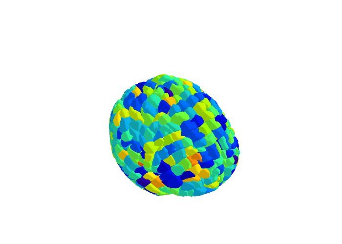

# The Yale Brain Atlas

(A project by Ryan Bose-Roy)

This repository is an **unofficial, work-in-progress** code library for the [Yale Brain Atlas](https://yalebrainatlas.github.io/YaleBrainAtlas/atlas_viewer.html#model=images/Yale_Brain_Atlas.obj,images/Yale_Brain_Atlas.mtl) (YBA). It can be used for analysis and visualization of the brain, from the level of individual parcels to the whole cortex. 

For the **official version** of the Yale Brain Atlas, please refer to work done by the [Yale Clinical Neuroscience Neuroanalytics group](https://medicine.yale.edu/lab/ynn/), and the following [GitHub Page](https://github.com/YaleBrainAtlas/YaleBrainAtlas?tab=readme-ov-file).

<picture>
    
</picture>

# Table of Contents
- [The Yale Brain Atlas](#the-yale-brain-atlas)
- [Table of Contents](#table-of-contents)
- [Installation](#installation)
- [How to Use the Yale Brain Atlas: Analysis](#how-to-use-the-yale-brain-atlas-analysis)
  - [Example Walkthrough](#example-walkthrough)
    - [Import and Instantiation](#import-and-instantiation)
    - [Parcel Parameters](#parcel-parameters)
      - [Defining parcel parameters at the whole-brain level](#defining-parcel-parameters-at-the-whole-brain-level)
        - [Working with 690 parcels (no corpus callosum) in the YBA](#working-with-690-parcels-no-corpus-callosum-in-the-yba)
        - [Get all parcel parameters together](#get-all-parcel-parameters-together)
      - [Defining parcel parameters at the individual parcel-level](#defining-parcel-parameters-at-the-individual-parcel-level)
    - [Connectivities](#connectivities)
    - [Other Data Types](#other-data-types)
- [How to Use the Yale Brain Atlas: Visualization](#how-to-use-the-yale-brain-atlas-visualization)
  - [Example Walkthrough](#example-walkthrough-1)
    - [Instantiation](#instantiation)
    - [Create a new plots](#create-a-new-plots)
    - [Add parcels](#add-parcels)
    - [Visualizing Plots](#visualizing-plots)
    - [Visualizing multiple parameters](#visualizing-multiple-parameters)
  - [Other functionalities](#other-functionalities)

# Installation

Please download the github repo in the appropriate local directory and install using pip
```
git clone https://github.com/RyanSBRoy/YaleBrainAtlas.git
pip install YaleBrainAtlas/
```

# How to Use the Yale Brain Atlas: Analysis

The YBA can be fetched and modified at the individual parcel level, as well as the global brain (atlas) level.

## Example Walkthrough

### Import and Instantiation
First, import the Yale Brain Atlas

```python
from YaleBrainAtlas import *
# OR from YaleBrainAtlas import YaleBrainAtlas
```

Initialize a brain atlas for a sample subject

```python
Subject = YaleBrainAtlas('Subject')
```

### Parcel Parameters

#### Defining parcel parameters at the whole-brain level

There are 696 parcels in the Yale Brain Atlas.
Parcel parameters can be defined globally for the brain as a list, set, or Pandas Series of 696 values, or a dictionary or pandas dataframe of 696 keys/rows corresponding to the parcel name and one value per key/row.

```python
Subject.CT = np.random.randn(696)
Subject.PET = np.random.randn(696)

print(Subject.PET)
print(Subject.CT)
```
##### Working with 690 parcels (no corpus callosum) in the YBA
Sometimes we exclude the corpus callosum in the YBA. This leaves us with values in the form of a list corresponding to 690 parcels, instead of 696. To bring this into a subject's brain atlas object, we must first transform the 690-parcel list into a 696-parcel list.

```python
clusters = np.random.randn(690).tolist()
Subject.clusters = pd.Series(Subject.parcel_names).map(dict(zip(Subject.parcel_names_noCC.copy(), clusters)))

print(Subject.clusters)
```

Note that Subject has both parcel_names (Subject.parcel_names), of length 696, and parcel_names_noCC, of length 690, which contain parcel names with and without the Corpus Callosum respectively. 

##### Get all parcel parameters together
Parcel parameters can be numerical values or strings. The parcel parameters assigned to a YBA object can be obtained as a pandas dataframe through the 'parcel_parameters' attribute

```python
Subject.parcel_parameters
```

#### Defining parcel parameters at the individual parcel-level
Parcel objects in the YBA implement lazy caching, meaning that they first pull their value directly from the global Yale Brain Atlas object, and then store that value locally. 

```python
Subject.CT = np.random.randn(696)
print(Subject.CT)

print(Subject.L_TP1_A) #the CT value is not found as an attribute of the parcel, because we haven't called it yet

print(Subject.L_TP1_A.CT)

print(Subject.L_TP1_A) #the CT value will now be found as an attribute of the parcel...
print(Subject.L_TP1_B) #...but it won't be found for L_TP1_B because we haven't asked for it yet! 
```

You can change an existing attribute value for a parcel by modifying the parcel.
```python
print(Subject.CT.at['L_TP1_A'])
Subject.L_TP1_A.CT = 5
print(Subject.CT.at['L_TP1_A'])
```

Modifying the attribute value for a parcel value at the whole-brain level is a bit more difficult, in that you will need to explicitly update the version counter so that the parcel knows to pull the value from the global Yale Brain Atlas object. I am currently working on getting the the YBA to handle this internally. 

```python
print(Subject.L_TP1_A.CT)

#use 'at': using '.loc' or setting Subject.CT['L_TP1_A'] directly creates a copy of the dataframe outside of the YBA
Subject.CT.at['L_TP1_A'] = 6 

#YOU NEED TO EXPLICITLY UPDATE THE VERSION COUNTER FOR THIS PARCEL'S ATTRIBUTE
Subject._bump_version('CT', parcel_idx=Subject.L_TP1_A.idx) 
print(Subject.L_TP1_A.CT)
```

Whole-brain parcel parameters can be initialized at the level of parcels.

```python
print('MEG' in Subject.attributes) #or Subject.parcel_parameters.columns --> should be False

Subject.L_TP1_A.MEG = 5
print(Subject.L_TP1_A.MEG)

print('MEG' in Subject.attributes) #you should see that MEG now exists 
print(Subject.MEG) #you should see that MEG is set to 5 for L_TP1_A, and every other parcel has None/NA
print(Subject.parcel_parameters) #you should see that MEG is set to 5, and every other parcel has None/NA
```

### Connectivities

Connectivities can be entered at the whole-brain level as a 696x696 pandas dataframe
```python
Subject.FunctionalConnectivity = pd.DataFrame(np.ones([696, 696]), index=Subject.parcel_names, columns=Subject.parcel_names)
print(Subject.L_TP1_A.FunctionalConnectivity)
```

Connectivities can be modified at either the parcel level, or the whole brain level
```python
Subject.FunctionalConnectivity.at['L_TP1_A', 'L_TP1_A'] = 5
print(Subject.L_TP1_A.FunctionalConnectivity)

Subject.L_TP1_A.FunctionalConnectivity = 6
print(Subject.FunctionalConnectivity.at['L_TP1_A', 'L_TP1_A'])
```

### Other Data Types

The YBA can handle most other data types besides lists, sets, pandas dataframes or series objects. 
Torch tensors should be set with shape (parcels, D1, D2, D3, ...), where parcels is the number of parcels, and D1, D2, etc. are arbitrary dimensions. Parcel-level retrieval and modification can be handled similarly as in the [#example-walkthrough].

When in doubt, a good rule of thumb is to represent data as a dictionary, with the keys as parcel names and the values as the corresponding data.

```python
import trimesh
mesh_group = {
    'L_TP1_A': trimesh.Mesh(points, faces),
    'L_TP1_B': trimesh.Mesh(points, faces),
    ...
    'R_CC_3': None
}

Subject.mesh = mesh_group

Subject.L_TP1_B.mesh
```

This should work for most common data types. Note that in the above example, the data type was a trimesh object, which is handled explicitly by the YBA. 

# How to Use the Yale Brain Atlas: Visualization

The visualizer for the Yale Brain Atlas can visualize parcels and a variety of superimposed parameters.

## Example Walkthrough

### Instantiation

The visualizer needs a YBA object to initialize and reference.

```python
from YaleBrainAtlas import *

Subject = YaleBrainAtlas('Subject')
yba = YBAVisualizer(Subject)

```

### Create a new plots

Plots in the visualizer are plotly graph objects. the '.fig' attribute for the visualizer returns the plotly graph object itself, which can be modified using the standard plotly graph object functions.

```python
yba.new("SamplePlot") #creates a new plot
print(yba.fig) #prints the plot we are currently in, which is SamplePlot
yba.new("NewPlot") #creates a new plot
print(yba.fig) #prints the plot we are currently in, which is NewPlot
print(list(yba.figures)) #prints 'Main' (default), 'SamplePlot' and 'NewPlot', since these are the new plots we created
yba.set('SamplePlot') #brings us back to SamplePlot
yba.fig #this is the the plot we are currently in (SamplePlot)
```

That individual plotly plots are stored in the 'yba' visualizer as a dictionary called 'yba.figures', so the standard dictionary operations can be used to add, retrieve, change, or delete plots.

### Add parcels

Parcels can be added by using the '.add_parcels' attribute. 

'.add_parcels' takes as arguments:
1. 'intensities': list of 696, 690, or len(parcel_labels) corresponding to the intensity of the parameter on the colorscale
2. 'segment': 'whole', 'left_hemisphere', 'right_hemisphere', or list of parcels to show
3. 'labels': list of 696, 690, or len(parcel_labels) corresponding to the hovertext labels for the parcels
4. 'colorscale': plotly colorscale (e.g. 'Reds', 'Blues', 'Greens')
5. 'opacity': the opacity of the parcels being shown (between 0 and 1)
6. **kwargs: any other plotly arguments for plotly.fig.add_trace

```python
Subject = YaleBrainAtlas('Subject')
yba = YBAVisualizer(Subject)

Subject.CCEPs = np.random.randn(696)

yba.new("SamplePlot") #creates a new plot
yba.add_parcels('clusters', segment='whole', opacity=1, colorscale='Rainbow',
                lighting=dict(ambient=0.1,
                diffuse=1,
                fresnel=3,  
                specular=0.5, 
                roughness=0.05),
                lightposition=dict(x=100,
                                    y=200,
                                    z=1000),)
yba.show("SamplePlot")

```

Parcel groupings can be colored separately

```python
Subject = YaleBrainAtlas('Subject')
yba = YBAVisualizer(Subject)

Subject.CCEPs = np.random.randn(696)

RTP = ParcelNames[np.where(np.char.startswith(ParcelNames, 'L_TP'))].tolist()
NotRTP = ParcelNames[np.where(~np.char.startswith(ParcelNames, 'L_TP'))].tolist()

yba.new("ClearerPole")
yba.add_parcels('CCEPs', RTP, colorscale='Blues', opacity=0.5)
yba.add_parcels('CCEPs', NotRTP, colorscale='Reds', opacity=1)
yba.show("ClearerPole")
```

### Visualizing Plots
For greater customizability, I recommend using the plotly visualization from .fig directly, rather than the yba.show() function.

```python
yba.new("SamplePlot") #creates a new plot
yba.add_parcels('clusters', segment='whole', opacity=1, colorscale='Rainbow',
                lighting=dict(ambient=0.1,
                diffuse=1,
                fresnel=3,  
                specular=0.5, 
                roughness=0.05),
                lightposition=dict(x=100,
                                    y=200,
                                    z=1000),)

yba.fig.update_layout(title_text='Title') #allows us to set our own title
yba.fig.show()
```

### Visualizing multiple parameters
In this case, we just show the count for each parcel that has multiple parameters defined for it. For parcels that have only one parameter defined for them, we show their corresponding parameter intensity.

```python
Subject = YaleBrainAtlas('Subject')
yba = YBAVisualizer(Subject)

Subject.Param_0 = np.random.randn(696)

Subject.L_MF2_A.Param_1 = 2
Subject.L_SF2_C.Param_1 = 2
Subject.L_TP1_A.Param_1 = 2
Runa.L_MF3_B.Param_1 = 2

Runa.L_MF3_B.Param_2 = 4

yba.new("SamplePlot") #creates a new plot
yba.add_parcels(['Param_0', 'Param_1', 'Param_2'], segment='whole', opacity=1,
                lighting=dict(ambient=0.1,
                diffuse=1,
                fresnel=3,  
                specular=0.5, 
                roughness=0.05),
                lightposition=dict(x=100,
                                    y=200,
                                    z=1000),)

yba.fig.update_layout(title_text='Title') #allows us to set our own title
yba.fig.show()
```

## Other functionalities

The parcel objects have a function to create a convex hull around a that parcel, given a voxel mesh of cubes.

The atlas object has a function to determine the closest parcels to a set of points in MNI152 space. 